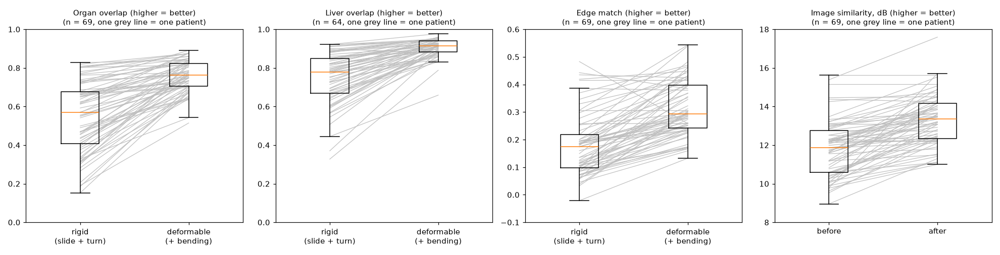
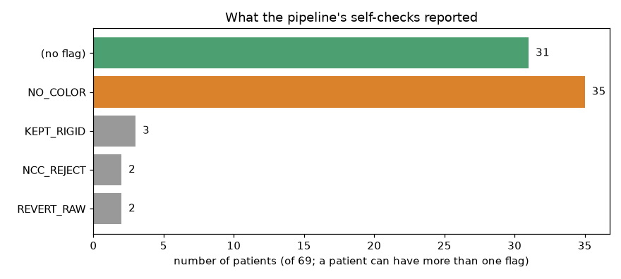
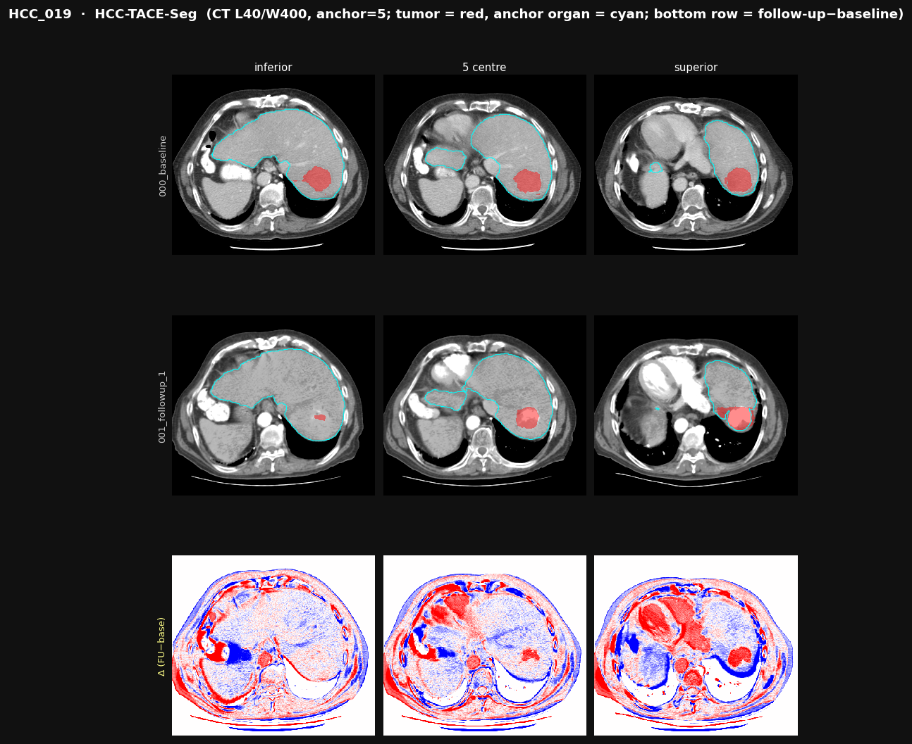
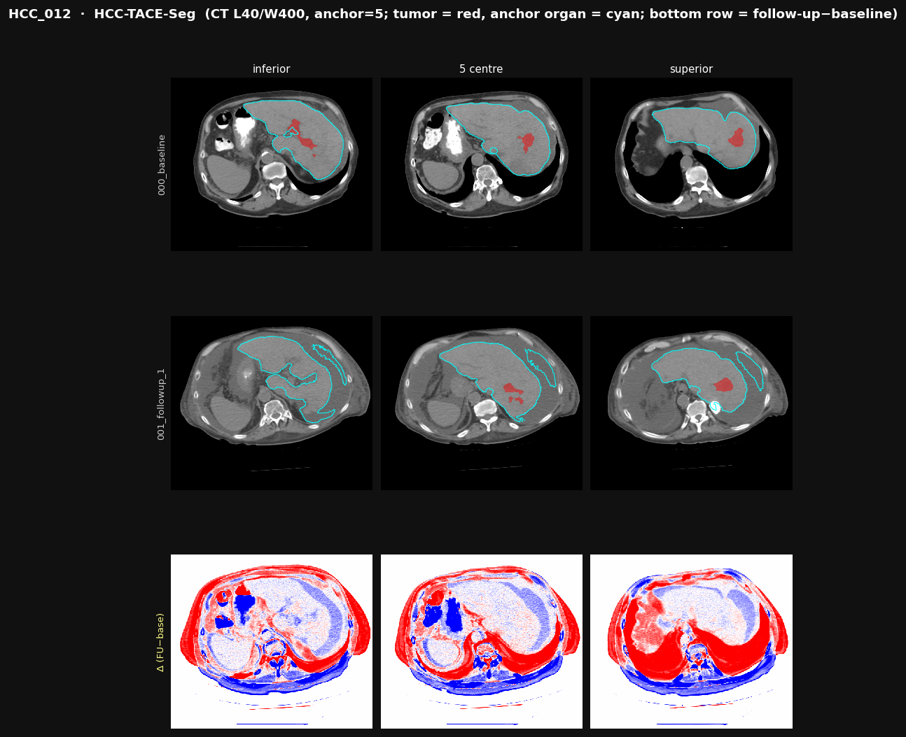
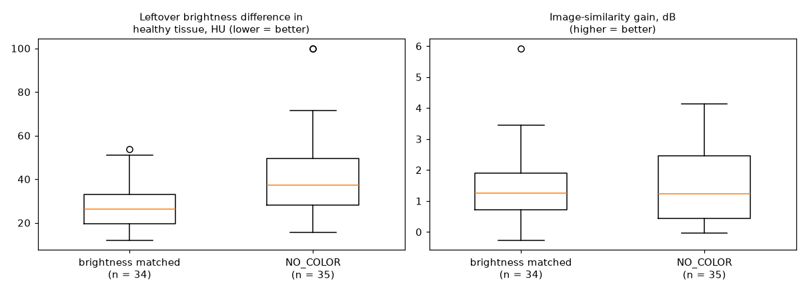

# Registration performance report: HCC-TACE-Seg, 70 patients

**Project:** HOPE, earlier detection of liver cancer recurrence
**Pipeline:** team pipeline `processing/HCC-TACE-Seg/` (standardise → expert masks → CADS organs → SegVol tumours → longitudinal registration)
**Data:** HCC-TACE-Seg (TCIA), patients HCC_001–HCC_070, pre-TACE vs post-TACE contrast CT
**Compute:** Lightning AI Studio, 1× NVIDIA T4 (16 GB), 400 GB disk
**Run date:** September 2026

---

## 1. Summary

| | Result |
|---|---|
| Patients processed | **70** standardised, **69** registered, **0 errors**. HCC_054 had only one usable visit, so there was no pair to register |
| Liver overlap after registration | **0.91** median (0.78 after rigid alignment only); improved in **63 of 64** patients |
| Organ overlap (all shared organs) | **0.57 → 0.76** median; improved in **69 of 69** patients |
| Independent edge-alignment check | **0.17 → 0.29** median (+70%) |
| Stacked contrast phases (fixed in this run) | **9 patients / 13 scans** split into single phases; all 9 registered successfully |
| Main open issue | **Brightness mismatch:** in **35 of 69** patients (51%) the before and after scans differ in contrast enhancement too much for brightness matching, so the difference image carries contrast differences as well as real change |

**Conclusion:** the pipeline **aligns anatomy reliably**: the liver lines up at a median overlap of 91% across scans taken weeks apart. **Comparing brightness** between visits is reliable in only about half of the patients, because they were scanned in different contrast phases. That is the next thing to fix before the difference images are used to look for small new lesions.

---

## 2. What registration is and why it matters for HOPE

Each patient was scanned **before** TACE treatment and again **after** it (median about 2 months apart). Between the two scans the patient lies differently on the table, breathes differently, and the stomach and bowel contents change. So the liver sits in a **different position and shape** in each scan.

**Registration moves and gently bends the follow-up scan until it lies exactly on top of the baseline scan**, point for point. Only then can the two be compared. Subtracting them (follow-up minus baseline) should leave healthy tissue at about zero and highlight only **real change**, such as a treated or new tumour. That is the core of HOPE's longitudinal approach.

The team pipeline aligns in two rounds, then corrects brightness:

| Round | What it does | Analogy |
|---|---|---|
| **Rigid** | Slides and turns the whole scan (no bending) | Sliding and turning a photo on a table |
| **Deformable** | Gently bends the scan, guided by organ outlines from CADS (liver onto liver, spleen onto spleen, …) | Stretching a rubber sheet so the shapes match |
| **Brightness matching** | Makes healthy organs equally bright in both scans | Matching the lighting of two photos |

The pipeline **checks its own work** after each round and keeps a result only if it made the alignment better.

---

## 3. Pipeline and changes made for this run

```
tables → 1 standardise (1 mm) → 2 expert masks → 3 CADS organs (GPU) → 4 SegVol tumours (GPU) → 6 longitudinal registration
```

Three fixes were made to the team code before the run:

| File | Problem | Fix |
|---|---|---|
| `lib/standardize.py` | Some series store **two contrast phases in one folder** (the same slice positions twice). They were read as one scan, so the anatomy appeared twice (Figure 5) and registration failed (HCC_002 on the pilot: organ overlap 0.37). **21 of 105** patients are affected. | Such folders are split by DICOM `AcquisitionNumber`. For each patient, the phases whose **aorta and portal-vein brightness** (measured on CADS outlines) match best between visits are kept. Normal folders are read exactly as before. |
| `pipeline/02_seg_to_mask.py` | Two different rounding methods could disagree on the last decimal of a slice position, which crashed the step (HCC_021) | One rounding method throughout |
| `lib/tcia_metadata.py` | The dataset was downloaded on Windows (`\` in paths), so no scans were found on Linux | Both kinds of slash are accepted |

**Configuration note:** the team's `Combined/` folder (SegVol calibration and TotalSegmentator organ masks) was not available. So SegVol ran with the team code's fallback settings (warnings `_segvol_calib … missing` and `no liver TotalSeg mask`).

**Run time:** about 12.6 h for 68 patients (plus a 2-patient test run beforehand): standardise 7.7 h (CPU), CADS + SegVol 1.6 h (GPU), registration 3.3 h (CPU). About 11 minutes per patient.

---

## 4. Metrics: what each number means

All metrics are **computed by the team pipeline itself** (`CTProcess/metadata*.json`).

| Metric (name in the output) | What it measures, in plain words | Range | Better |
|---|---|---|---|
| **Organ overlap** (`wdice_rigid`, `wdice_deformed`) | Lay each organ outline from the baseline over the same organ from the aligned follow-up: what fraction overlaps? Averaged over all organs found in both scans, bigger organs counting more. Known as the *Dice score*. | 0 (no overlap) – 1 (perfect) | higher |
| **Liver overlap** (`per_organ_dice.liver`) | The same overlap for the **liver only**, the organ HOPE cares about most | 0 – 1 | higher |
| **Edge match** (`gradncc_rigid`, `gradncc_deformed`) | Do edges (organ borders, vessel walls) fall in the same place in both scans? It ignores brightness and does **not** use the CADS organ outlines, so it is an **independent check** of the alignment | −1 – 1 (0 = no match) | higher |
| **Image similarity** (`psnr_before_db`, `psnr_after_db`) | How alike the two scans look pixel by pixel over the whole shared body area, before and after processing. +3 dB ≈ half the remaining difference. The absolute values are low because bowel, stomach and contrast really do differ between visits, so **the change matters, not the level** | dB | higher |
| **Organs used** (`shared_organs`) | How many organs were found in both scans and used to guide the bending | 0 – 17 | more = more reliable |
| **Organ movement** (`centroid_shift_mm`) | How far (mm) the organs had to move to line up: a measure of how differently the patient lay, **not** of quality | mm | — |
| **Leftover brightness difference** (`healthy_resid_med_hu`) | After alignment, the typical brightness difference remaining in **healthy tissue** (tumour excluded), in Hounsfield units | HU | lower |
| **Flags** (`flags`) | What the self-checks decided (Section 5.3) | — | — |

**Note for interpreting overlap scores:** organ and liver overlap are measured with the **same CADS outlines that guided the deformable bending**, so they tend to be **optimistic**. The edge-match score does not use those outlines and improved too, which confirms the improvement is real.

---

## 5. Results

### 5.1 Main scores (69 registered patients)

| Metric | Rigid only (slide + turn) | After deformable (+ bending) | Improved in |
|---|---|---|---|
| **Organ overlap** | 0.57 [0.41–0.68] | **0.76 [0.71–0.82]** | **69 / 69** |
| **Liver overlap** | 0.78 [0.67–0.85] | **0.91 [0.88–0.94]** | **63 / 64** |
| **Edge match** | 0.17 [0.10–0.22] | **0.29 [0.24–0.40]** | — |
| **Image similarity** | 11.9 dB [10.6–12.8] | **13.3 dB [12.3–14.2]** | **61 / 69** |

Values are median [25th–75th percentile]. Liver overlap is reported for the 64 patients whose deformable result was kept (Section 5.3).

| Other numbers | Median [25th–75th] (range) |
|---|---|
| Organs used for alignment | 13 [12–14] (7–16) |
| Organ movement needed | 11 mm [6–21] (2–42) |
| Leftover brightness difference in healthy tissue | 30 HU [25–42] (12–100) |
| Body overlap after step 1 (rigid, whole body) | 0.91 (lowest 0.76) |
| Liver overlap ≥ 0.90 after deformable | 41 of 64 patients |



**Figure 1.** Each grey line is one patient: the left end is after rigid alignment, the right end after deformable registration (for image similarity: raw vs processed follow-up). Boxes show the middle 50% of patients; the orange line is the median. Almost every line rises.

### 5.2 Best and worst patients (organ overlap after deformable registration)

| Best | Rigid → deformable | Worst | Rigid → deformable |
|---|---|---|---|
| HCC_030 | 0.73 → **0.89** | HCC_012 | 0.19 → **0.51** |
| HCC_068 | 0.64 → **0.88** | HCC_067 | 0.33 → **0.54** |
| HCC_019 | 0.77 → **0.88** | HCC_004 | 0.47 → **0.64** |
| HCC_052 | 0.62 → **0.88** | HCC_050 | 0.49 → **0.64** |
| HCC_020 | 0.80 → **0.87** | HCC_022 | 0.32 → **0.64** |

Even the worst cases improved substantially; they started from a much larger initial misalignment.

### 5.3 What the self-checks decided



**Figure 2.** Flags recorded by the pipeline for the 69 patients.

| Flag | Meaning | Patients |
|---|---|---|
| (no flag) | Everything applied as planned | 31 |
| `NO_COLOR` | Brightness matching **made things worse, so it was skipped**: the contrast enhancement differs too much between the two scans | **35** |
| `KEPT_RIGID` / `NCC_REJECT` | Bending did not improve the organ overlap enough, or disturbed the edges, so the rigid result was kept | 5 (HCC_011, 013, 016, 026, 046) |
| `REVERT_RAW` | Processing made the follow-up look worse overall, so the unprocessed scan was kept (safety net) | 2 (HCC_020, 041) |

### 5.4 Examples

**Good example: HCC_019** (organ overlap 0.77 → 0.88)



**Figure 3.** Rows: baseline, aligned follow-up, and **difference** (red = brighter at follow-up, blue = darker, white = unchanged). Cyan = liver outline; red = tumour outline (SegVol). The liver has the same shape and position in both rows, and healthy liver is almost white in the difference row. The tumour region stands out as a **red patch**: a real change after treatment. Heart and vessels are red because the contrast was brighter at follow-up, which is a timing difference, not misalignment.

**Worst example: HCC_012** (organ overlap 0.19 → 0.51, flag `NO_COLOR`)



**Figure 4.** The follow-up shows little contrast enhancement (grey vessels) compared with the baseline, and the body outline differs strongly between visits. The liver centre is roughly aligned, but the difference row is dominated by **brightness and body-wall differences** rather than real change.


---

## 6. Next step: brightness mismatch in about half of the patients

**Observation.** In **35 of 69** patients (51%) the pipeline skipped brightness matching (`NO_COLOR`): the baseline and follow-up were acquired with **different contrast enhancement**, most likely **different contrast phases** (e.g. arterial vs portal-venous, or little contrast at follow-up as in HCC_012).

**Effect.** The mismatch does **not** harm the alignment: liver overlap is 0.92 in these patients vs 0.90 in the others. It **does** harm the brightness comparison: the leftover brightness difference in healthy tissue is **37 HU vs 26 HU** (median, about 40% higher).



**Figure 6.** Patients whose brightness could be matched vs `NO_COLOR` patients. Left: leftover brightness difference in healthy tissue (lower = better). Right: image-similarity gain.

**Why it matters for HOPE.** HOPE aims to find **small new lesions** in the follow-up minus baseline difference image. When the two scans are in different contrast phases, the whole liver changes brightness, and an HCC's typical enhancement pattern (bright in the arterial phase, fading later) changes too. Contrast differences can then **hide** a small lesion or **look like** one.

**Proposed fix.** Select the **same contrast phase at both visits for every patient**, not only for stacked folders. The aorta and portal-vein brightness check (Section 5.5) already works. It would be extended from choosing *between passes inside one folder* to choosing *between the different series of a visit*: a visit often has several contrast series, and step 1 currently picks the one with the most slices. Patients with no matching phase at both visits would be **flagged and analysed separately**.

---

## 7. Files in this folder

| Path | Contents |
|---|---|
| `REPORT.md` | This report |
| `per_patient_metrics.csv` | All scores per patient (one row per patient) |
| `report_figures/` | Figures 1, 2, 5, 6 |
| `CTProcess/metadata*.json` | Registration scores written by the pipeline (step 6) |
| `CTProcessed/metadata*.json` | Step 1 details: series used, stacked-phase choices with aorta/portal-vein HU |
| `CTProcess/visualization/` | Registration QC figure per patient (baseline, aligned follow-up, difference) |
| `CTProcessed/visualization/` | Step 1–4 figures per patient (montage, expert masks, CADS organs, SegVol tumours) |
| `*/processing_log.txt`, `logs/run_70.log` | Full run logs |

`metadata.json` holds the 2-patient test run (HCC_002, HCC_005); `metadata_full70.json` holds the other 68 patients.
