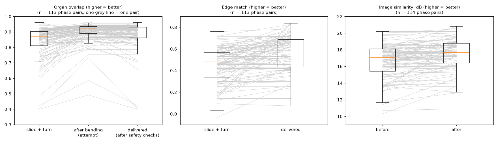
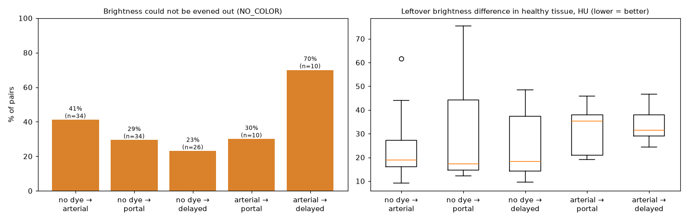
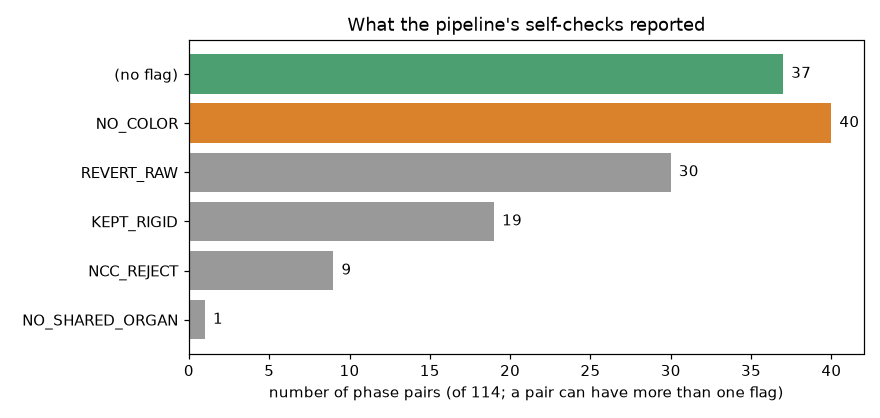
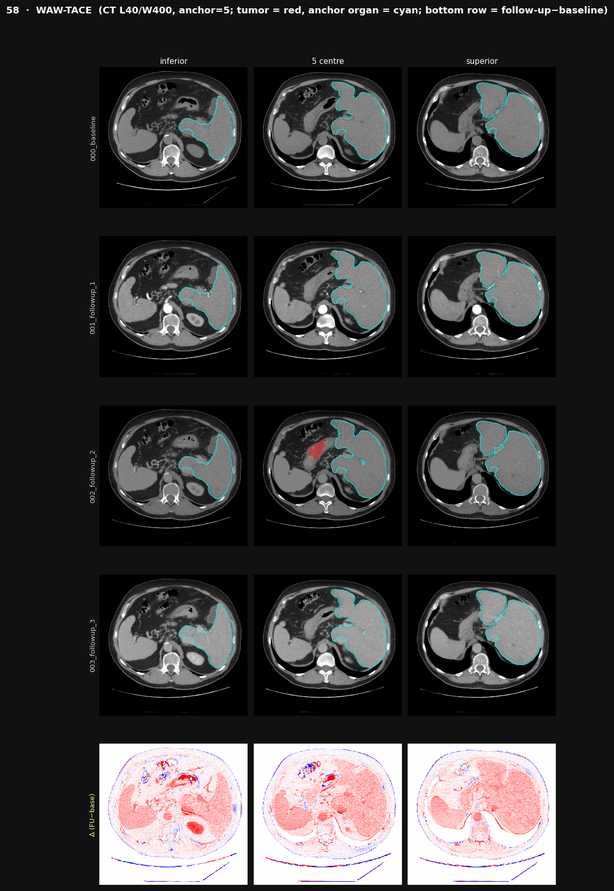
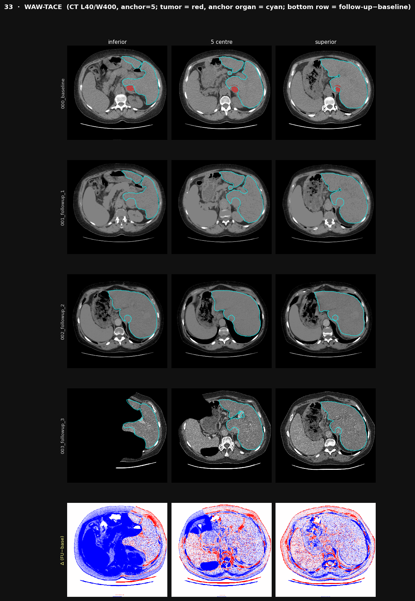

# Registration performance report: WAW-TACE, 44 patients (114 phase pairs)

**Project:** HOPE, earlier detection of liver cancer recurrence
**Pipeline:** team pipeline `processing/WAW-TACE/` (1 prepare phases → 2 CADS organs → 3 SegVol tumours → 5 longitudinal registration), code unchanged
**Data:** WAW-TACE (Zenodo 12741586), archive `ct_scans_1_4` (56 patients), multiphase contrast CT from one pre-TACE visit
**Compute:** Lightning AI Studio, 1× NVIDIA T4 (16 GB)
**Run date:** September 2026

---

## 1. Summary

| | Result |
|---|---|
| Patients prepared (stages 1–3) | **56** |
| Patients registered (stage 5) | **44**, giving **114 phase pairs**. The run stopped when the compute credits ran out; the remaining 12 patients (62, 63, 65, 66, 67, 69, 7, 72, 73, 74, 77, 8) were not reached |
| Starting alignment (slide + turn only) | Organs already overlap **0.87** (median); organs moved only **2 mm** |
| Organ overlap after bending (attempt) | **0.92**; better than slide + turn in **103 of 114** pairs |
| Organ overlap of the **delivered** scans | **0.91**. Safety checks kept the unbent scan in about half of the pairs |
| Liver overlap | **0.96–0.98** (the 2 patients where it was saved) |
| Brightness could not be evened out (`NO_COLOR`) | **40 of 114** pairs (35%). **Expected**, because the phases differ in contrast by design |
| Errors | **None** |

**Conclusion:** within one visit the scans are **almost aligned from the start**, and the pipeline lines them up **very well** (organ overlap 0.91, liver 0.96–0.98). Bending adds little, and the safety checks often keep the simpler result, which is sensible behaviour for same-day scans. Even with near-perfect alignment, **contrast phase alone changes the images strongly**, which confirms that longitudinal comparison (HCC-TACE-Seg) needs **the same phase at both visits**.

---

## 2. What is registered in WAW-TACE

Each WAW-TACE patient had **one CT visit before TACE**. During it, the scanner imaged the abdomen **up to four times within a few minutes**, while the injected contrast agent moved through the body:

| Phase | Label in files | What is bright |
|---|---|---|
| No dye (native) | `_0_` | nothing: no contrast agent yet |
| Arterial | `_1_` | arteries (aorta), arterial-phase tumour enhancement |
| Portal venous | `_2_` | liver and its veins |
| Delayed | `_3_` | everything moderately; contrast fading |

The pipeline takes the **first available phase as the reference** (the no-dye scan for 46 patients, the arterial scan for the 10 without a no-dye scan). It then aligns **each other phase to that reference, one at a time**. Each "reference + one other phase" is a **phase pair**:

```
patient with 4 phases → 3 pairs:   no dye ↔ arterial,  no dye ↔ portal,  no dye ↔ delayed
patient with 3 phases → 2 pairs:   e.g. arterial ↔ portal,  arterial ↔ delayed
```

37 patients have all 4 phases and 19 have 3. The 44 registered patients give **114 pairs**.

**Difference from HCC-TACE-Seg:** there, each patient has one pair of scans taken **weeks apart** (before vs after TACE). WAW-TACE tests the **same engine on same-day scans that differ only in contrast phase**.

---

## 3. Pipeline, configuration and completeness

```
1 prepare phases (NIfTI → 1 mm, rigid to reference phase, expert tumour masks carried along)
  → 2 CADS organs (GPU) → 3 SegVol tumours (GPU) → 5 longitudinal registration + brightness matching
```

- **No code changes** were needed for WAW-TACE. Its scans are separate NIfTI files per phase, so the stacked-phase problem of HCC-TACE-Seg does not occur.
- **Configuration note:** the team's `Combined/` folder (SegVol calibration and TotalSegmentator organ masks) was not available, so SegVol ran with the team code's fallback settings.
- **Incomplete run:** stages 1–3 finished for all 56 patients. Stage 5 processes patients in **text order** (10, 13, …, 19, 2, 20, …, 61, 62, …, 69, 7, 72, …, 77, 8), so the 12 unreached patients include 7 and 8. Stage 5 took about **6.2 h for 42 patients** (≈9 min per patient).
- **Where the numbers come from:** stage 5 writes its results file only when it finishes, so for this run the scores were taken from the pipeline's own **log lines** (`CTProcess/processing_log.txt`). The per-organ breakdown, including the liver, is only in the results file of the **2-patient test run** (patients 2 and 3).

---

## 4. Metrics: what each number means

All metrics are computed by the team pipeline itself.

| Metric | What it measures, in plain words | Range | Better |
|---|---|---|---|
| **Organ overlap** (`wDice`) | Lay each organ outline from the reference phase over the same organ in the aligned phase: what fraction overlaps? Averaged over all organs found in both, bigger organs counting more (*Dice score*) | 0 – 1 | higher |
| **Liver overlap** | The same, for the liver only | 0 – 1 | higher |
| **Edge match** (`gradNCC`) | Do organ borders and vessel walls fall in the same place? It ignores brightness and does not use the organ outlines, so it is an **independent check** of the alignment | −1 – 1 | higher |
| **Image similarity** (`PSNR`) | How alike the two scans look pixel by pixel in shared healthy tissue, before and after processing. Contrast differences between phases keep this lower than for identical scans, so **the change matters, not the level** | dB | higher |
| **Organs used** (`shared`) | How many organs were found in both scans and guided the bending | 0 – 17 | more |
| **Organ movement** (`COM`) | How far (mm) the organs had to move: how much the patient moved between phases, **not** a quality measure | mm | — |
| **Leftover brightness difference** (`med|Δ|`) | Typical brightness difference remaining in healthy tissue after processing | HU | lower |

### Three versions of the organ-overlap score
The pipeline tries bending, then its **safety checks** decide what to deliver. So organ overlap is reported three ways:

| Version | Meaning |
|---|---|
| **Slide + turn** | After the rigid alignment of stage 1 (no bending) |
| **After bending (attempt)** | What the bending reached. The log records this **even when the bent scan is later thrown away** |
| **Delivered** | The scan actually kept: the bending result if it passed the checks, otherwise the slide + turn value |

**Note:** the overlap scores use the **same CADS outlines that guided the bending**, so they tend to be optimistic. The edge-match score is independent and improved as well.

---

## 5. Results

### 5.1 Main scores (114 phase pairs, 44 patients)

| Metric | Slide + turn | After bending (attempt) | Delivered |
|---|---|---|---|
| **Organ overlap** | 0.87 [0.81–0.90] | **0.92 [0.89–0.94]** | **0.91 [0.86–0.93]** |
| **Edge match** | 0.48 [0.34–0.57] | — | **0.55 [0.43–0.69]** |
| **Image similarity** | 17.1 dB [15.4–18.1] | — | **17.7 dB [16.4–18.8]** |

Values are median [25th–75th percentile]; n = 113 pairs for overlap and edge match (one pair had no shared organ).

| Other numbers | Median [25th–75th] (range) |
|---|---|
| Organs used | 15 [14–16] (0–17) |
| Organ movement | 2 mm [2–5] (0–76) |
| Leftover brightness difference in healthy tissue | 22 HU [15–37] (9–75) |
| Stage 1 whole-body overlap after rigid alignment | 0.98 (lowest 0.73) |
| Pairs where bending improved organ overlap | 103 of 113 |
| Pairs where the bent scan was delivered | 57 of 114 |
| Pairs where image similarity improved | 72 of 114 |



**Figure 1.** Each grey line is one phase pair. Left: organ overlap after slide + turn, after the bending attempt, and delivered. Middle and right: edge match and image similarity before vs after. Boxes show the middle 50% of pairs; the orange line is the median.

### 5.2 Results by phase pair

| Phase pair | Pairs | Organ overlap: slide + turn → delivered | `NO_COLOR` | Bending not delivered | Leftover brightness difference |
|---|---|---|---|---|---|
| no dye → arterial | 34 | 0.88 → 0.91 | 14 | 20 | 19 HU |
| no dye → portal | 34 | 0.87 → 0.90 | 10 | 13 | 17 HU |
| no dye → delayed | 26 | 0.86 → 0.90 | 6 | 12 | 18 HU |
| arterial → portal | 10 | 0.86 → 0.93 | 3 | 6 | 35 HU |
| arterial → delayed | 10 | 0.80 → 0.87 | 7 | 6 | 32 HU |



**Figure 2.** Left: share of pairs where brightness could not be evened out. Right: leftover brightness difference in healthy tissue per phase pair.

Pairs **between two contrast phases** (arterial → portal/delayed) keep a much larger brightness difference (32–35 HU) than pairs against the no-dye scan (17–19 HU). Between two dyed phases, different organs brighten or fade by different amounts, which a single brightness correction cannot undo.

### 5.3 What the self-checks decided



**Figure 3.** Flags recorded by the pipeline (a pair can have more than one).

| Flag | Meaning | Pairs (of 114) |
|---|---|---|
| (no flag) | Everything applied as planned | 37 |
| `NO_COLOR` | Brightness matching made healthy tissue **less** alike, so it was skipped. The phases differ in contrast, which is **expected** here | **40** |
| `REVERT_RAW` | The processed scan looked **less** like the reference than the unprocessed one, so the unprocessed scan was delivered (safety net) | **30** |
| `KEPT_RIGID` | Bending did not improve organ overlap enough, so the slide + turn result was kept | 19 |
| `NCC_REJECT` | Bending disturbed the edges, so the slide + turn result was kept | 9 |
| `NO_SHARED_ORGAN` | CADS found no organ in both scans (patient 25, arterial → portal), so the slide + turn result was kept | 1 |

**Why the safety checks often reject bending here:** the phases are already nearly aligned (2 mm movement), so there is little to gain. The contrast differences between phases mean a slight bend can make the pixel-by-pixel comparison worse, and the safety net then keeps the simpler scan. For same-day scans this is the expected, sensible outcome.

### 5.4 Liver overlap (test patients 2 and 3)

| Patient | Phase pair | Liver overlap: slide + turn → after bending | Flag |
|---|---|---|---|
| 2 | no dye → arterial | 0.966 → **0.972** | — |
| 2 | no dye → portal | 0.781 → **0.964** | — |
| 2 | no dye → delayed | 0.940 → **0.972** | — |
| 3 | no dye → arterial | 0.964 → 0.978 | `REVERT_RAW` (delivered 0.964) |
| 3 | no dye → portal | **0.946** | `KEPT_RIGID` |
| 3 | no dye → delayed | 0.957 → 0.977 | `REVERT_RAW` (delivered 0.957) |

### 5.5 Best and worst pairs (delivered organ overlap)

| Best | Pair | Slide + turn / bending / **delivered** | | Worst | Pair | Slide + turn / bending / **delivered** |
|---|---|---|---|---|---|---|
| 50 | arterial → portal | 0.96 / 0.90 / **0.96** (kept rigid) | | 33 | no dye → portal | 0.40 / 0.49 / **0.40** (`NCC_REJECT`) |
| 24 | no dye → portal | 0.92 / 0.96 / **0.96** | | 59 | no dye → delayed | 0.40 / 0.73 / **0.40** (`REVERT_RAW`) |
| 53 | no dye → delayed | 0.89 / 0.95 / **0.95** | | 34 | no dye → portal | 0.42 / 0.59 / **0.42** (`REVERT_RAW`) |
| 16 | no dye → arterial | 0.95 / 0.94 / **0.95** (kept rigid) | | 59 | no dye → portal | 0.66 / 0.89 / **0.66** (`REVERT_RAW`) |
| 29 | no dye → portal | 0.90 / 0.95 / **0.95** | | 46 | arterial → delayed | 0.71 / 0.80 / **0.71** (`NCC_REJECT`, `REVERT_RAW`) |

In the worst pairs, bending **did** improve organ overlap (e.g. patient 59: 0.40 → 0.73), but the safety checks rejected it because the overall image comparison got worse. These pairs start from a poor rigid alignment, mostly because the phases cover **different parts of the body** (see patient 33 below).

### 5.6 Examples

**Good example: patient 58** (no dye → arterial: organ overlap 0.67 → **0.94**)



**Figure 4.** Rows: reference (no dye), arterial, portal, delayed, and the **difference** of the last phase minus the reference (red = brighter, blue = darker, white = unchanged). Cyan = liver outline; red = tumour outline (SegVol). The liver outline has the same shape in every row. The difference row is **evenly pink over the liver and spleen**: that is the **contrast agent itself** (the delayed scan has dye, the reference has none), not misalignment. There are no sharp red/blue edges. The red outline in the portal row lies outside the liver, near the pancreas; it is a SegVol error.

**Worst example: patient 33** (no dye → portal: organ overlap **0.40**, bending rejected)



**Figure 5.** The delayed scan covers only **part of the body** (lowest slice: most of the body is missing), and the body position differs between phases. The difference row is dominated by **missing and shifted body areas**, not by real change.

---

## 6. Comparison with HCC-TACE-Seg

| | HCC-TACE-Seg | WAW-TACE |
|---|---|---|
| What is compared | Same patient **weeks apart** (before vs after TACE) | Contrast **phases of one visit**, minutes apart |
| Patients / pairs registered | 69 / 69 | 44 / 114 |
| Organ movement | 11 mm | **2 mm** |
| Organ overlap: slide + turn → after bending | 0.57 → 0.76 | 0.87 → 0.92 (delivered 0.91) |
| Liver overlap after bending | 0.91 | 0.96–0.98 (2 patients) |
| Bent scan delivered | 62 of 69 | 57 of 114 |
| `NO_COLOR` | 51%, **a problem** (visits should match) | 35%, **expected** (phases differ by design) |
| Leftover brightness difference | 30 HU | 22 HU |

---

## 7. Next steps

1. **Use WAW-TACE's phase labels to test phase detection.** HCC-TACE-Seg needs the same contrast phase at both visits (see the HCC-TACE-Seg report, Section 6), but its scans carry no phase labels, so the phase must be measured from aorta and portal-vein brightness on the CADS outlines. WAW-TACE has **known labels** for every scan and CADS outlines for all 56 patients already, so it can show **how accurately** that measurement identifies no-dye, arterial, portal and delayed scans before it is used to pick matching scans in HCC-TACE-Seg.
2. **Optional: complete the remaining 12 patients** (≈2 h of GPU machine time). Stage 5 resumes where it stopped (`bash processing/WAW-TACE/run.sh --steps 5` with a new `LONG_SHARD_TAG`); it would also write the results file with per-organ (liver) overlap for those patients.

---

## 8. Files in this folder

| Path | Contents |
|---|---|
| `REPORT.md` | This report |
| `per_pair_metrics.csv` | All scores per phase pair (from the stage 5 log) |
| `report_figures/` | Figures 1–3 |
| `CTProcess/processing_log.txt` | Stage 5 log: one score line per phase pair (source of the numbers above) |
| `CTProcess/metadata.json` | Stage 5 results file of the 2-patient test run (patients 2 and 3), including per-organ overlap |
| `CTProcess/visualization/` | Registration QC figure per patient (all phases + difference) |
| `CTProcessed/metadata.json` | Stage 1 details for all 56 patients: phases present, rigid whole-body overlap, alignment method, expert tumour mask per phase |
| `CTProcessed/visualization/` | Stage 1–3 figures per patient (phase montage, CADS organs, SegVol tumours) |
| `run_waw56.log` | Full log of the main run |
